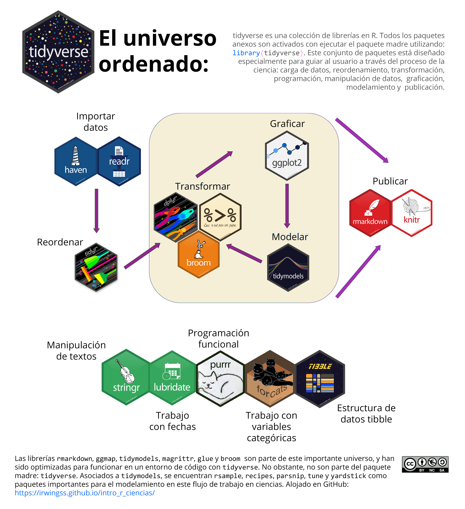
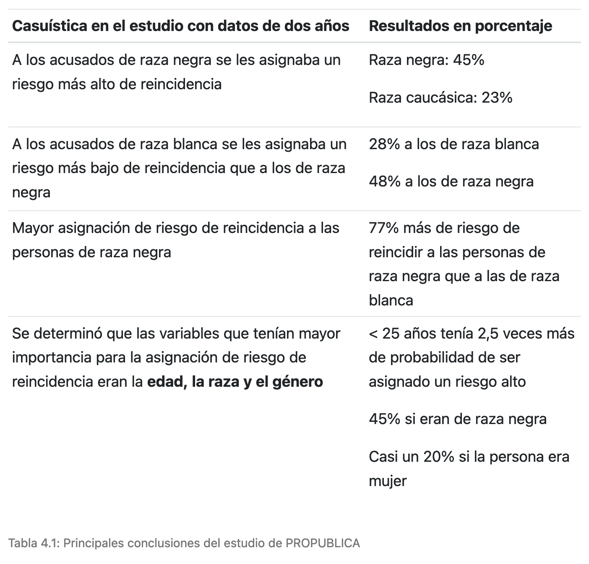
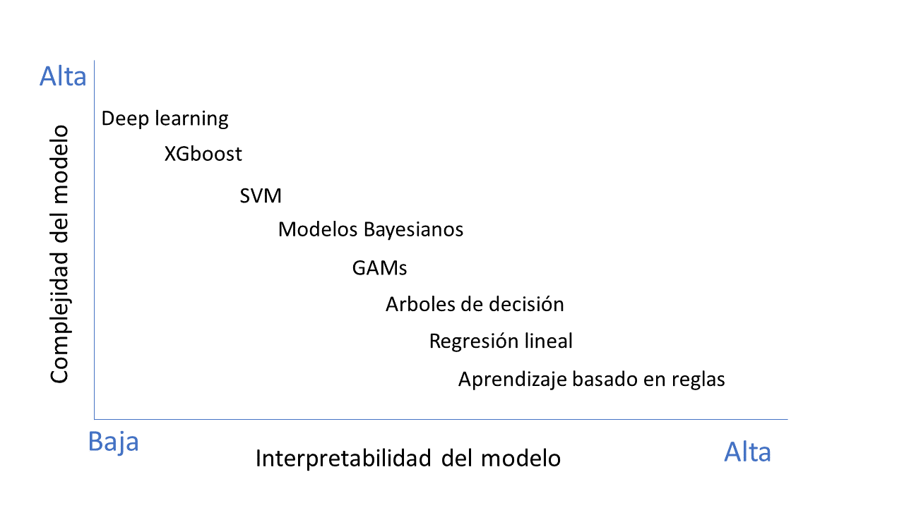

```{r setup, include=FALSE}
knitr::opts_chunk$set(echo = TRUE)
```

# 3.6 Organización de datos con el tidyverse

```{r library, message=FALSE}
# remotes::install_github("cdr-book/CDR")
library(tidyverse)
library(CDR)
```

## 3.6.1 El tidyverse y su flujo de trabajo

{width="600"}

## 3.6.2 Transformación de datos con dplyr

### filas

Los verbos de dplyr para trabajar con filas son principalmente:

```         
•   filter()
•   slice()
•   arrange()
```

Aunque hay otros verbos que pueden ser útiles dependiendo del contexto:

```         
• distinct(): Devuelve filas únicas. 
• sample_n() y sample_frac(): Toman una muestra de filas. 
• top_n(): Selecciona las filas con los valores más altos o más bajos.
```

### columnas

Para trabajar con columnas en dplyr, los verbos más comunes son:

```         
•   select()
•   mutate()
•   rename()
•   summarize()
```

Otros verbos útiles cuando se trabaja con columnas:

```         
•   transmute(): Similar a mutate(), pero solo mantiene las columnas nuevas o transformadas.
•   pull(): Extrae una sola columna como un vector.
•   relocate(): Cambia el orden de las columnas.
```

### resumen y agrupación

Para el resumen y la agrupación de datos en dplyr, los verbos más comunes son:

```         
•   summarize() (o summarise()) 
•   group_by()
•   ungroup()
```

Aunque hay más:

```         
•   count(): Cuenta el número de observaciones por grupo.
•   n(): Función dentro de summarize() para contar el número de filas en cada grupo.
•   n_distinct(): Cuenta el número de valores distintos en una columna.
```

# Sesión del 04 de julio, 2024

## 3.6.3 Combinación de datos

Hacemos un DataSet

```{r}
students <- tibble(
  student_id = c(1, 2, 3, 4, 7, 9, 10),
  name = c("Ana", "Luis", "María", "Carlos", "Pedro", "Laura", "Martha"),
  age = c(23, 45, 31, 29, 32, 31, 21)
)

courses <- tibble(
  student_id = c(1, 2, 3, 5, 6, 7, 8, 10),
  course = c("Matemáticas", "Física", "Química", "Biología", "Matemáticas", "Física", "Química", "Biología")
)
```

```{r}
library(dplyr)
```

-   inner_join(): se incluyen las filas de ambas tablas para las que coinciden las variables de unión.

```{r}
# Inner join
inner_joined_data <- inner_join(students, courses, by = "student_id")
```

-   left_join(): se incluyen todas las filas de la primera tabla y solo las de la segunda donde hay coincidencias.

```{r}
# Left join
left_joined_data <- left_join(students, courses, by = "student_id")
```

-   right_join(): se incluyen todas las filas de la segunda tabla y solo las de la primera donde hay coincidencias.

```{r}
# Right join
right_joined_data <- right_join(students, courses, by = "student_id")
```

-   full_join(): se incluyen todas las filas de las dos tablas.

```{r}
# Full join
full_joined_data <- full_join(students, courses, by = "student_id")
data_student <- arrange(full_joined_data, student_id)
```

-   semi_join(): devuelve todas las filas del data frame de la izquierda (students) donde hay coincidencias en el data frame de la derecha (courses), pero solo las columnas del data frame de la izquierda.

```{r}
# Semi join
semi_joined_data <- semi_join(students, courses, by = "student_id")
```

-   anti_join(): devuelve todas las filas del data frame de la izquierda (students) donde no hay coincidencias en el data frame de la derecha (courses).

```{r}
# Anti join
anti_joined_data <- anti_join(students, courses, by = "student_id")
```

Otras formas de unir datos:

-   bind_cols()
-   bind_rows()
-   add_row()
-   add_column()

## 3.6.4 Reorganización de datos

```{r}
library(tidyr)
```

pivot_wider() convierte filas en columnas. Utilizaremos el formato original y lo haremos más ancho.

```{r}
# Convertir el conjunto de datos a un formato más ancho
wider_data <- contam_mad %>%
    pivot_wider(
      id_cols = !nom_mag,
      names_from = "nom_abv",
      values_from = "daily_mean")
          
# Ver las primeras filas del conjunto de datos ancho
head(wider_data)
```

pivot_longer() convierte columnas en filas. Regresar al formato original (long)

```{r}
# Convertir de nuevo a un formato largo
long_data <- wider_data %>%
  pivot_longer(cols = c("BEN", "SO2", "NO2", "EBE", "CO","NO",
                        "PM10", "PM2.5", "TOL","NOx"), 
               names_to = "nom_abv_l", 
               values_to = "daily_mean_l",
               values_drop_na = TRUE)

# Ver las primeras filas del conjunto de datos largo
head(long_data)
```

`unite()`\` combina múltiples columnas en una sola. Vamos a combinar las columnas date y station.

`separate()`\` divide una columna en múltiples columnas. Vamos a crear un ejemplo donde combinamos date y station y luego los separamos.

```{r}
# Combinar las columnas date y station
contam_mad_unite <- contam_mad %>%
  unite("date_station", fecha, estaciones, sep = "_")

# Ver las primeras filas del conjunto de datos modificado
head(contam_mad_unite)

# Separar la columna date_station en dos columnas nuevamente
contam_mad_separated <- contam_mad_unite %>%
  separate(date_station, into = c("date", "station"), sep = "_")

# Ver las primeras filas del conjunto de datos separado
head(contam_mad_separated)
```

**Eliminar filas con NA**

```{r}
data_student

library(dplyr)
na.omit(data_student)

library(tidyr)
# Eliminar filas que contienen cualquier NA
clean_data <- drop_na(data_student)

# Eliminar filas solo si 'age' tiene NA
clean_data <- drop_na(data_student, age)
```

**Sustituir valores NA**

`replace_na()`\` de tidyr

función `mutate()`\` con `ifelse()`\` o `coalesce()`\` de dplyr.

```{r}
# remplaza los NA por el valor indicado
data_student %>%
  replace_na(list(age = 0, course = "Desconocido"))
```

```{r}
# calcula la media de la edad para reemplazar los NA con la media
mean_age <- mean(data_student$age, na.rm = TRUE)
data_student %>%
  mutate(age = ifelse(is.na(age), mean_age, age))

# otra manera
data_student %>%
  mutate(age = coalesce(age, mean_age))
```

-   `fill()`

```{r}
# Rellenar valores NA hacia adelante
data_student %>%
  fill(age, course, .direction = "down")

# Rellenar valores NA hacia atrás
data_student %>%
  fill(age, course, .direction = "up")
```

# Capítulo 4

# Ética en la ciencia de datos

... subdisciplina de la Filosofía que estudia de manera sistemática el comportamiento humano desde las nociones del bien y del mal -\> Razomamiento moral

... pretende establecer los principios a partir de los cuales evaluar las acciones y decisiones ... -\> Encuadre o principios de valores

## Ramas de la ética

-   Metaética
-   Ética normativa o deontología
-   Ética aplicada: reflexión que debe acompañar a la toma de decisiones en el contexto de la praxis profesional de los científicos de datos.

**Datos** - ciclo de vida - edad, profesión, experiencia, raza, género, procedencia geográfica, etc.

## Principios éticos

-   autonomía,
-   justicia,
-   evitar daños
-   generar beneficios

Ejemplo - Algoritmo de Amazon, 2015

## {width="500"}

### IA - BigData

HLEGAI (High Level Expert Group Artificial Intelligence) (2018) Los principios incluyen respeto por la dignidad humana, prevención de daños, y equidad. Los requisitos abarcan aspectos como transparencia, responsabilidad, privacidad, y control humano. El objetivo es promover una IA que sea beneficiosa para la sociedad, respetando los derechos fundamentales y valores éticos.

## Recursos en R para equidad = principio de equidad:

Sesgos algorítmicos = errores sistemáticos en los que se puede incurrir cuando, al hacer muestreos o ensayos, se seleccionan o favorecen unas respuestas frente a otras. - sesgo en la adquisición de los datos - sesgos históricos - sesgos de representación - sesgos de medida - sesgos de implementación

Ejemplo de COMPAS (Correctional Offender Management Profiling for Alternative Sanction)

{width="600"}

Algoritmos:

\- Metodologías globales o locales

\- Metodologías intrínsecas o post hoc

\- Metologías ligadas al modelo o agnósticas del modelo

```{r}
library(fairness)
#library(EDFfair)
```

## Recursos en R para explicabilidad:

{width="600"}

**Relación entre explicabilidad y complejidad del modelo**

{width="600"}

```{r}
library(shapr)
library(lime)
```
